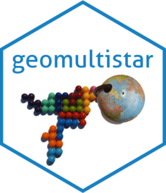
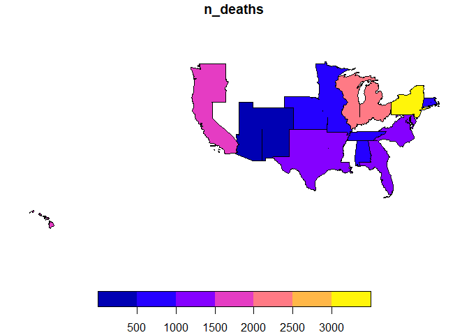

<!-- README.md is generated from README.Rmd. Please edit that file -->

# geomultistar <a href="https://josesamos.github.io/geomultistar/"></a>

<!-- badges: start -->

[](https://CRAN.R-project.org/package=geomultistar)
[](https://github.com/josesamos/geomultistar/actions/workflows/R-CMD-check.yaml)
[](https://app.codecov.io/gh/josesamos/geomultistar?branch=master)
[](https://www.r-pkg.org:443/pkg/geomultistar)
<!-- badges: end -->

*Multidimensional systems* allow complex queries to be carried out in an
easy way. The *geographic dimension*, together with the *temporal
dimension*, plays a fundamental role in multidimensional systems.
Through the `geomultistar` package, vector layers can be associated to
the attributes of geographic dimensions, so that the results of
multidimensional queries can be obtained directly as vector layers. In
other words, this package allows **enriching multidimensional queries
with geographic data**.

The multidimensional structures on which we can define the queries can
be created from flat tables with
[`starschemar`](https://CRAN.R-project.org/package=starschemar) package
or imported directly using functions from `geomultistar` package.

## Installation

You can install the released version of geomultistar from
[CRAN](https://CRAN.R-project.org) with:

``` r
install.packages("geomultistar")
```

And the development version from [GitHub](https://github.com/) with:

``` r
# install.packages("devtools")
devtools::install_github("josesamos/geomultistar")
```

## Example

If we start from a flat table, we can generate a star schema using the
[`starschemar`](https://CRAN.R-project.org/package=starschemar) package,
as described in its examples.

If we have a star schema in another tool, we need to import the fact and
dimension tables into R in the form of tables implemented by `tibble`
(`mrs_fact_age`, `mrs_fact_cause`, `mrs_where`, `mrs_when` and `mrs_who`
in the example). Once we have them in this format, we have to build a
`multistar` structure from them: This structure can contain multiple
fact and dimension tables, so facts can share dimensions. The definition
for tables obtained from the case detailed in
[`starschemar`](https://CRAN.R-project.org/package=starschemar) is
included below. The measures of the facts are defined and the
relationships between facts and dimensions are established.

``` r
library(geomultistar)

ms <- multistar() |>
  add_facts(
    fact_name = "mrs_age",
    fact_table = mrs_fact_age,
    measures = "n_deaths",
    nrow_agg = "count"
  ) |>
  add_facts(
    fact_name = "mrs_cause",
    fact_table = mrs_fact_cause,
    measures = c("pneumonia_and_influenza_deaths", "other_deaths"),
    nrow_agg = "nrow_agg"
  ) |>
  add_dimension(
    dimension_name = "where",
    dimension_table = mrs_where,
    dimension_key = "where_pk",
    fact_name = "mrs_age",
    fact_key = "where_fk"
  ) |>
  add_dimension(
    dimension_name = "when",
    dimension_table = mrs_when,
    dimension_key = "when_pk",
    fact_name = "mrs_age",
    fact_key = "when_fk",
    key_as_data = TRUE
  ) |>
  add_dimension(
    dimension_name = "who",
    dimension_table = mrs_who,
    dimension_key = "who_pk",
    fact_name = "mrs_age",
    fact_key = "who_fk"
  ) |>
  relate_dimension(dimension_name = "where",
                   fact_name = "mrs_cause",
                   fact_key = "where_fk") |>
  relate_dimension(dimension_name = "when",
                   fact_name = "mrs_cause",
                   fact_key = "when_fk")
```

Once we have a `multistar` structure, we will associate vector layers to
the attributes of the geographic dimensions. We can use existing layers
or generate them from the previous definitions. As a result we will have
a `geomultistar` structure.

``` r
gms <-
  geomultistar(ms, geodimension = "where") |>
  define_geoattribute(
    attribute = "city",
    from_layer = usa_cities,
    by = c("city" = "city", "state" = "state")
  ) |>
  define_geoattribute(
    attribute = "county",
    from_layer = usa_counties,
    by = c("county" = "county", "state" = "state")
  )  |>
  define_geoattribute(
    attribute = c("state"),
    from_layer = usa_states,
    by = c("state" = "state")
  ) |>
  define_geoattribute(from_attribute = "state")
```

In the last definition, because no geographic attribute is specified,
the rest of the dimension’s attributes are automatically defined from
the layer associated with the indicated parameter.

Finally, we can define multidimensional queries on this structure using
the functions available in the
[`starschemar`](https://CRAN.R-project.org/package=starschemar) package.
When executing these queries, using the functionality implemented in
package `geomultistar`, the vector layers of the attributes will be
taken into account to result in a new vector layer.

``` r
library(starschemar)

gdqr <- dimensional_query(gms) |>
  select_dimension(name = "where",
                   attributes = c("division_name", "region_name")) |>
  select_dimension(name = "when",
                   attributes = c("year", "week")) |>
  select_fact(name = "mrs_age",
              measures = c("n_deaths")) |>
  select_fact(
    name = "mrs_cause",
    measures = c("pneumonia_and_influenza_deaths", "other_deaths")
  ) |>
  filter_dimension(name = "when", week <= "03") |>
  run_geoquery(wider = TRUE)
```

The result is a vector layer that we can save or we can see it as a map,
using the functions associated with the `sf` class.

``` r
class(gdqr)
#> [1] "list"

plot(gdqr$sf[,"n_deaths_01"])
```



Although we have indicated in the query the attributes `division_name`
and `region_name`, as can be seen in the figure, the result obtained is
at the finest granularity level, in this case at the `division_name`
level.

Only the parts of the divisions made up of states where there is
recorded data are shown. If we wanted to show the full extent of each
division, we should have explicitly associated a layer at that level.

The result includes the meaning of each variable in table form.

|                 id_variable                 |                 measure                  | week |
|:-------------------------------------------:|:----------------------------------------:|:----:|
|                 n_deaths_01                 |                 n_deaths                 |  01  |
|                 n_deaths_02                 |                 n_deaths                 |  02  |
|                 n_deaths_03                 |                 n_deaths                 |  03  |
|                  count_01                   |                  count                   |  01  |
|                  count_02                   |                  count                   |  02  |
|                  count_03                   |                  count                   |  03  |
| mrs_cause_pneumonia_and_influenza_deaths_01 | mrs_cause_pneumonia_and_influenza_deaths |  01  |
| mrs_cause_pneumonia_and_influenza_deaths_02 | mrs_cause_pneumonia_and_influenza_deaths |  02  |
| mrs_cause_pneumonia_and_influenza_deaths_03 | mrs_cause_pneumonia_and_influenza_deaths |  03  |
|          mrs_cause_other_deaths_01          |          mrs_cause_other_deaths          |  01  |
|          mrs_cause_other_deaths_02          |          mrs_cause_other_deaths          |  02  |
|          mrs_cause_other_deaths_03          |          mrs_cause_other_deaths          |  03  |

It can be saved directly as a *GeoPackage*, using the
`save_as_geopackage` function.

``` r
save_as_geopackage(vl_sf_w, "division")
```
